# MERN Project - Russian Revolution (Robbie, Nina & Ellie)

#### Links

- **Trello Board for Project Management (Whole Project)**: https://trello.com/b/0v9PguSo/mern-project-russian-revolution

- **Trello Board for Implementation (Coding)**: https://trello.com/b/uaooTZA0/russian-revolution-implementataion-coding

---

## [R1] Website Description

### Purpose

The purpose of our software is to allow the accurate manual image annotation of property features within apartment floor plans, in order to more effectively evaluate apartment pricing. In the future, this will also allow our client to incorporate this project with computer vision and machine learning.

---

### Functionality/Features

**1. Image Annotation** - Users will be able to tag certain features of an image using one or more tags. The data will automatically be saved to the database every time a user modifies a tag. The user will be able to indicate when the annotation of an image is finished through saving the amended image(all the tags are placed). After submitting the image, the user will be unable to modify their tags.

**2. Tag Management and Search** - Users will be able to search from existing tags, create new tags and modify tags through the use of image annotation. Tags are globally accessible to users across the system.

**3. Annotation Review** - Users will be able to review annotation results, and mark annotations as incorrect and request re-annotation.

**4. Role-based authentication** - Users have access to different elements of the application based on their roles (admin or regular users) and basic Access Control Lists (ACLs).

**5. Image Flow Management** - Users will be able to organise images hierarchically through the system (e.g. Project->Building->Floor).

**6. Image Metadata Management** - Users will be able to upload a CSV document, which contains metadata of an image (including image URLs). They will also be able to add additional metadata to this document through manually adding key and value pairs.

**7. Image Navigation** - Users will be able to zoom in and out the image and to drag it.

---

### Target Audience

The target audience for our application is our client Skychute and professionals within the real estate industry. Another group of our target audience is other developers who are interested in image annotation techniques.

---

### Tech Stack

**Application and Data**

- **JavaScript**: A high-level, just-in-time compiled, multi-paradigm programming language that conforms to the ECMAScript specification.
- **React**: A JavaScript library for building user interfaces.
- **MongoDB**: A cross-platform document-oriented (non-relational) database program.
- **Express**: A web application framework for Node.js.
- **Node**: An open-source, cross-platform, JavaScript runtime environment that executes JavaScript code outside of a browser.
- **Amazon S3**: A service offered by Amazon Web Services that provides object storage through a web service interface.
- **SASS**: A preprocessor scripting language that is interpreted or compiled into Cascading Style Sheets (CSS).
- **HTML5**: A software solution stack that defines the properties and behaviours of web page content by implementing a markup-based pattern to it.
- **CSS3**: A style sheet language used for describing the presentation of a document written in a markup language like HTML.

**Utilities**

- **Balsamiq**: A mockup tool for wireframing.
- **Trello**: A web-based Kanban-style list-making application.
- **Pinterest**: A tool to store images for ideas of mood board.

**Developer Operations**

- **GIT**: A free and open version control system.
- **GitHub**: A platform for source control.
- **GitKraken**: A Git GUI client for Windows, Mac and Linux. It helps developers become more productive and efficient with Git.
- **Heroku**: A platform for deploying our application.
- **JEST**: A delightful JavaScript Testing Framework with a focus on simplicity.

**Business Tools**

- **Slack**: A cloud-based proprietary instant messaging platform for communication within team and with client.
- **Google Docs**: A tool for documentation collaboration.

---

## [R2] Dataflow Diagram

- **Logical dataflow diagram Level 0**: An overview of the whole system.

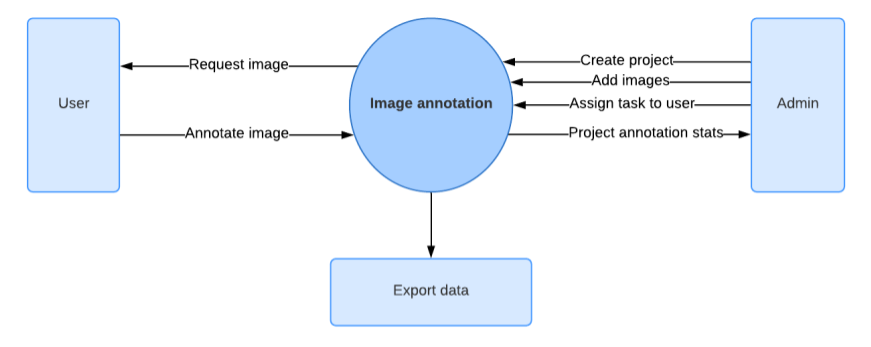

- **Logical dataflow diagram Level 1**: A more detailed breakdown of the Context Level Diagram (Level 0).

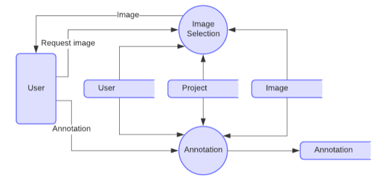

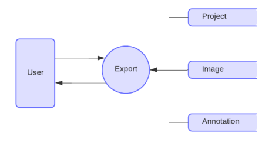

---

## [R3] Application Architecture Diagram

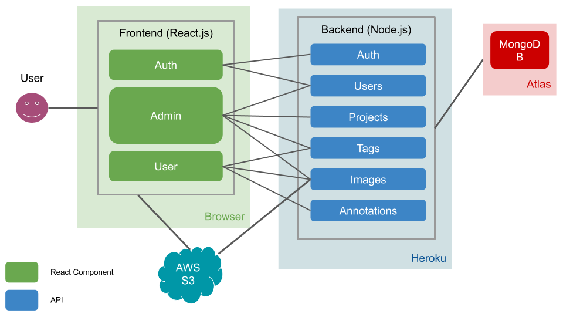

---

## [R4] User Stories

### [Draft Version]

**Admins**

- Can create projects -> create buildings -> apt (with description: .csv) -> upload floor plan images to different buildings
- Admin can assign projects or buildings to regular users
- Can add, view, update and delete floor plans (full CRUD resources)
- Can add, view, update and delete regular users (full CRUD resources)
- Can review the tagged floor plans submitted by regular users and, if needed, reverse the status of the tagged floor plans (from ‘completed’ back to ‘editable’), so that users can edit it again.

**Regular Users**

- Can tag property features on the floor plans (tags are CRUD resources, i.e. users can create, read, remove and delete tags)
- Can save the tagged floor plan multiple times before the final submission. After users submit the tagged plan, it will be further checked by the admin user. Regular users CANNOT change the tagged floor plan after submission.

### [Final Version]

**ALL USERS**

- **Angel**: As a user, I would like to sign-up for an account, so I can log into my account on the website later.
- **Jurra**: As a user, I would like to log into my existing account, so I can use the functionalities provided by the website.
- **Tom**: As a user, I would like to browse the website on my mobile, computer and my tablet, so I can use this application on different devices.
- **Ellie**: As a user, I would like to sign-out from the website, so my account is more secure.

**ADMINS**

- **Nina**: As the CEO of Skychute, I would like to organise images in a certain structure, so it is easier for our company to maintain the data.
- **Mark**: As a developer at Skychute, I would like to grant some users admin access, so we can have more admin users to manage our projects.
- **Robbie**: As a Project Manager at Skychute, I would like to assign projects and buildings to regular users, so users can tag the features on the floor plan images.
- **Elliot**: As a Project Manager at a construction company, I would like to add, view, update and delete projects.
- **Wayne**: As a Project Manager at Skychute, I would like to add, view, update and delete buildings.
- **Alex**: As a Project Manager at a construction company, I would like to add, view, update and delete apartments.
- **Prad**: As a Project Manager at Skychute, I would like to upload floor plan images and enter apartment information to apartments.
- **Ragan**: As a Project Manager at Skychute, I would like to review tagged floor plans submitted by regular users, so I can manage the project progress.
- **Dale**: As a Project Manager at Skychute, I would like to have the ability to reverse the status tagged floor plans (from ‘completed’ back to ‘editable’), so users can edit it again.

**Regular Users**

- **Luke**: As a Property Valuer, I would like to tag the property features on the floor plans, so I can better evaluate the property price.
- **Chelsea**: As a Real Estate Agent, I would like to create, read, remove and delete tags, so I can manage the tags as I wish.
- **Max**: As a Real Estate Agent, I would like to save the tagged plans multiple times before submission, so I can go on a coffee break and come back to the image I am working on.

## [R5] Wireframes

- **All Users** - Landing Page
  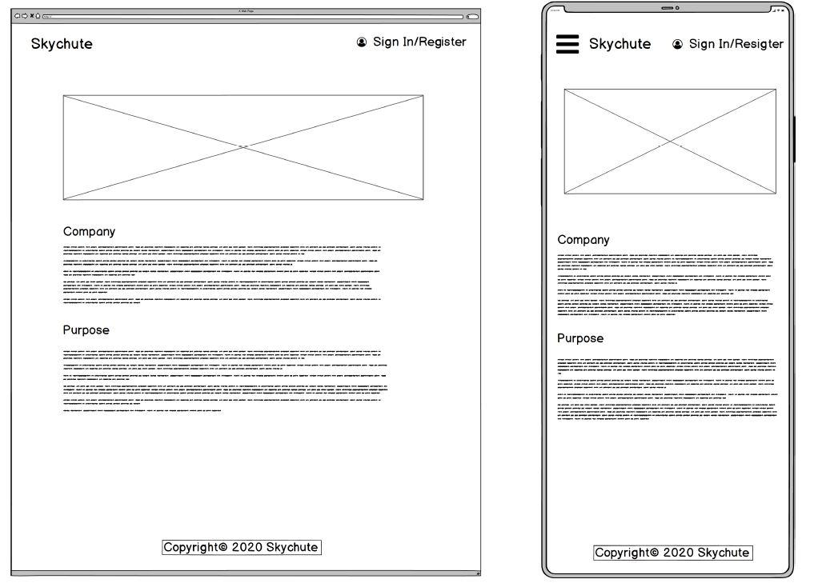

- **All Users** - Register Account
  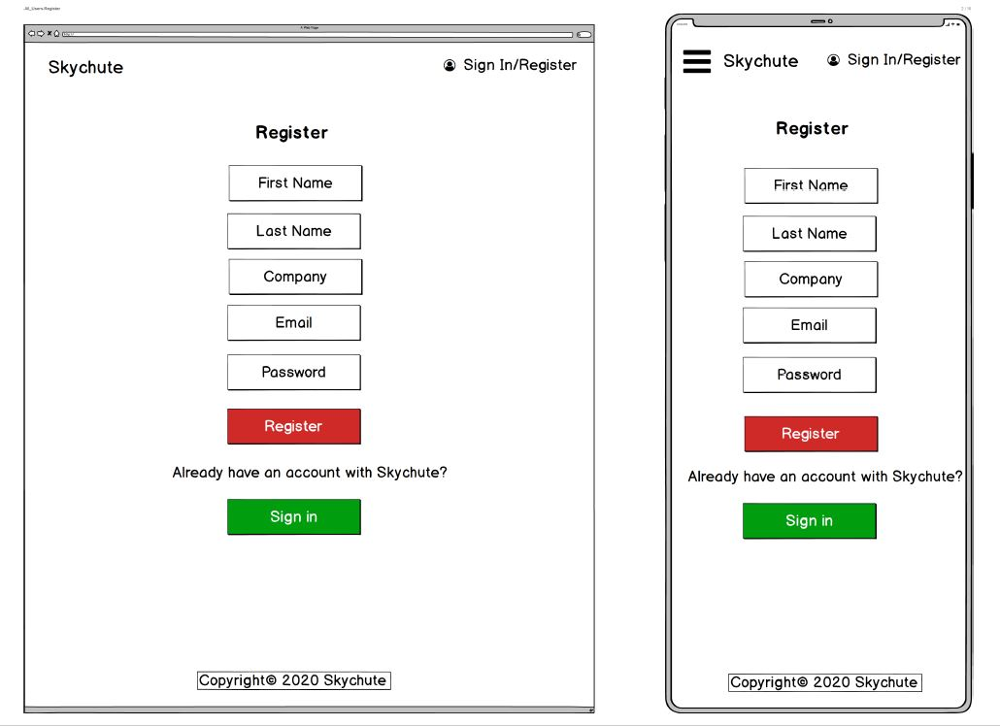

- **All Users** - Landing Page
  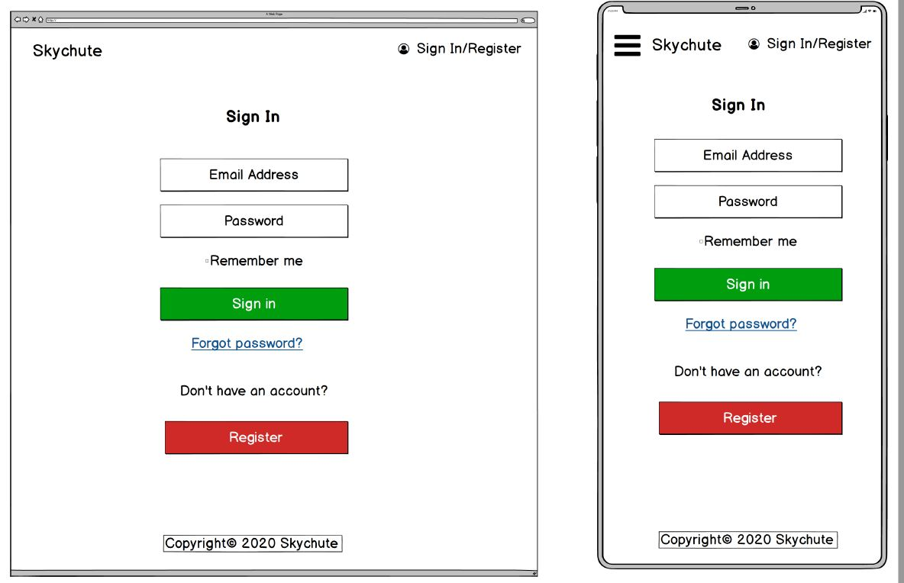

- **Admin** - Create Projects
  

- **Admin** - Create Buildings

- **Admin** - Create Apartments
  

- **Admin** - Manage Users
  

- **Users** - User Dashboard
  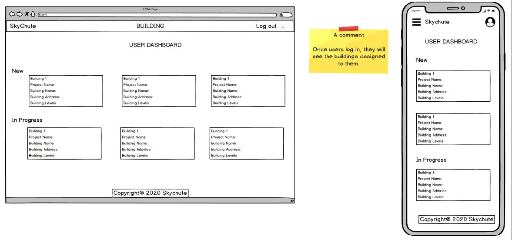

- **Users** - User Buildings
  

- **Users** - User Dashboard
  

## [R6] Screenshots of Trello board

- **Project Management** - Day 1
  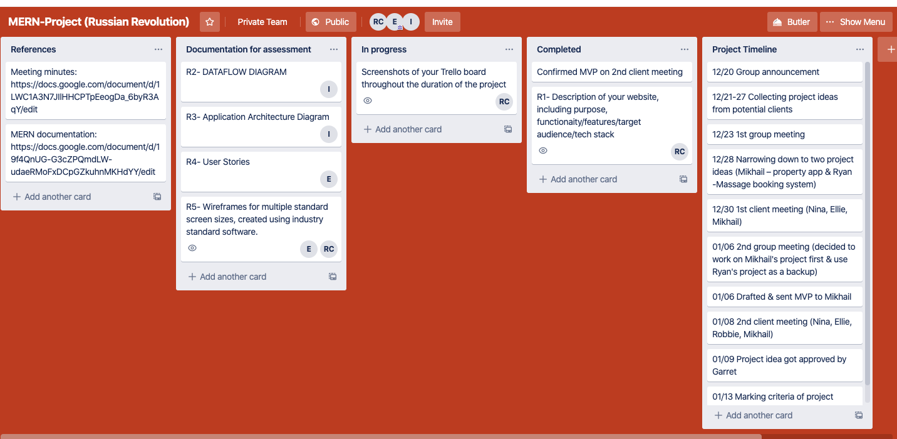

- **Project Management** - Day 1 (example of update)
  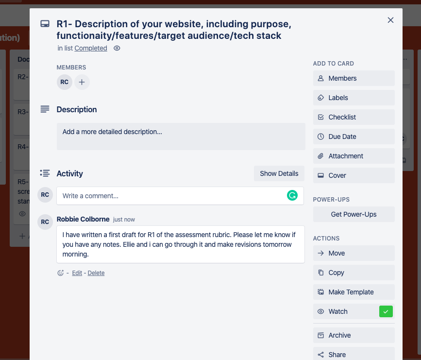

- **Project Management** - Day 2

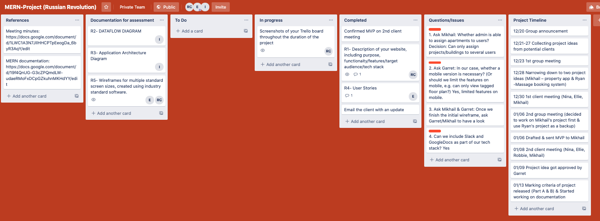

- **Project Management** - Day 4

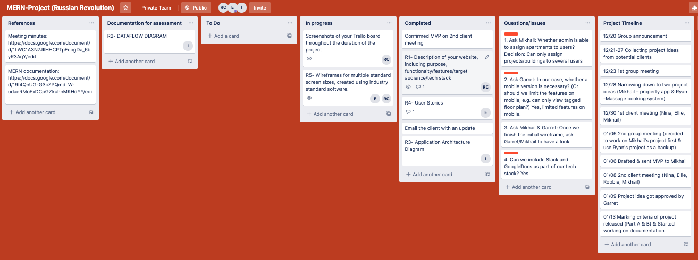

- **Project Management** - Day 5

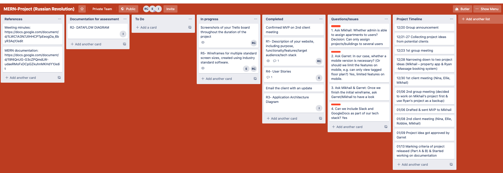

- **Implementation (Coding)** - Day 1

